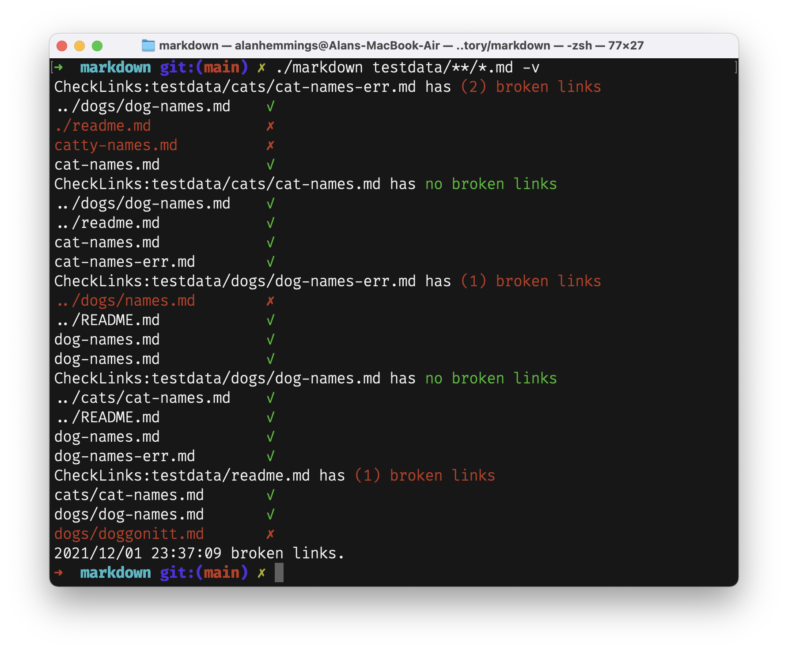

# markdown link checker

cicd tool for validating markdown files contains no broken links, so that it can be added as a check as part of the build. If you rename a file and don't remember to update your readme, then `markdown` will stop the build until all the links are correct.

**Installing**

```
go install github.com/goblinfactory/markdown
```

**Usage**

Run from the root of your solution using either glob patterns e.g. `markdown testdata/**/*.md` in nix or osx, and when running in windows specify each of the filenames separated with spaces.

```css
markdown testdata/**/*.md
```


```css
markdown testdata/**/*.md -v
```


**Adding to makefile**

Will exit with (-1) fatal, and stop any build if added to a makefile and there are errors.

internal packages

- [ansi/ansi.go](internal/ansi/ansi.go) : *Ansi color printing*
- [mystrings/strings.go](internal/mystrings/strings.go) : *misc string utils*
- [regexs/pairmatcher.go](internal/regexs/pairmatcher.go) : *regex 'pair' matching*

## todo

- add `-ignore {glob}` to allow you to ignore a folder. e.g. in this case, folders with testdata. Make it easier to use wildcard glob from root, eg. `/**/*.md`